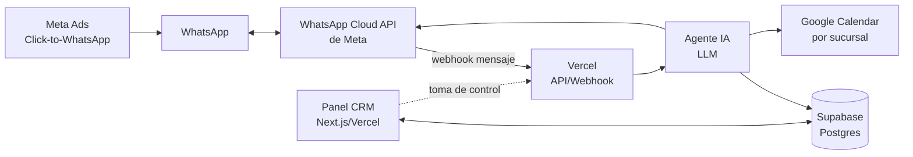
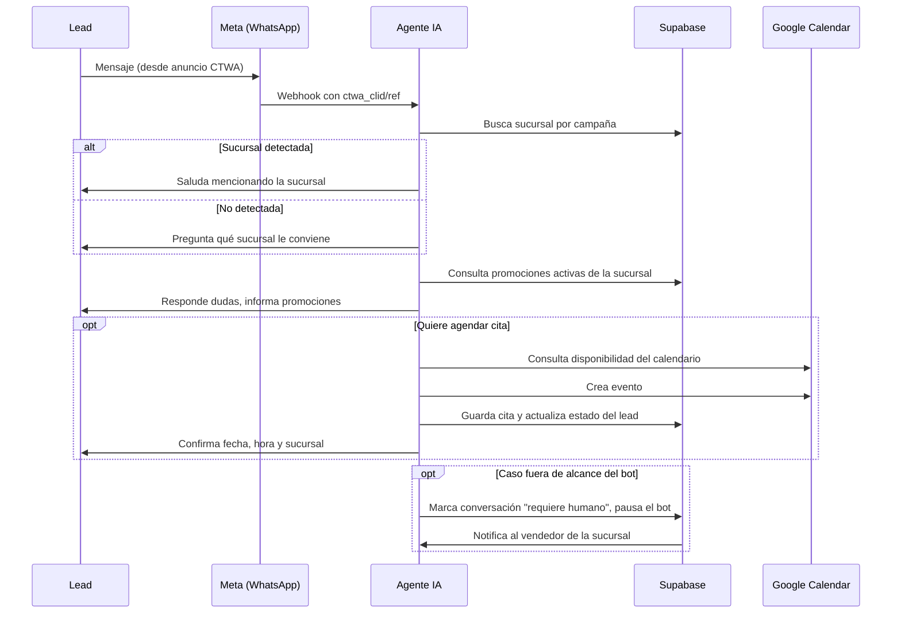

# Optuz CRM — Especificación del proyecto

CRM sobre WhatsApp con agente IA 24/7 (WhatsApp Cloud API de Meta + Supabase + Vercel + GitHub) para atender leads de Meta Ads y agendar citas en Google Calendar en las 5 sucursales; primer módulo del ERP Optuz.

## Arquitectura técnica

Stack: **WhatsApp Cloud API de Meta** (integración directa con una app propia de Meta: WABA, plantillas, webhooks, envío/recepción; sin proveedor intermedio), **Supabase** (Postgres + Auth + Edge Functions), **Next.js en Vercel** (panel CRM y endpoints API/webhook), **GitHub** (repo y CI/CD hacia Vercel). El LLM del agente IA corre en un servicio propio (Edge Function o API route) que Meta invoca por webhook en cada mensaje entrante.



El panel CRM y el webhook del agente comparten la misma base de código y la misma base de datos, para que el vendedor vea en vivo lo que el bot está haciendo.

## Sucursales y datos maestros

Cada sucursal es un registro maestro en Supabase con su propio Google Calendar (para no cruzar citas entre locales) y, cuando exista, su propio identificador de campaña de Meta Ads para la detección automática.

| Sucursal | Dirección | Calendario Google | Detección por campaña |
| --- | --- | --- | --- |
| Huánuco | Jr. 28 de Julio 1131, frente al Ministerio Público | Calendario dedicado | ID de campaña/anuncio Huánuco |
| Tingo María | Av. Tito Jaime 343, costado de FerroHogar | Calendario dedicado | ID de campaña/anuncio Tingo María |
| Aucayacu | Jr. Grau 180, costado de Mifarma | Calendario dedicado | ID de campaña/anuncio Aucayacu |
| Tocache | Jr. Freddy Aliaga 754, frente a residencial Bolívar | Calendario dedicado | ID de campaña/anuncio Tocache |
| Uchiza | Av. Leoncio Prado 615, Plaza de Armas | Calendario dedicado | ID de campaña/anuncio Uchiza |

Con un solo número de WhatsApp para las 5 sucursales, el `branch_id` de cada campaña de Meta Ads debe mapearse a la sucursal correcta antes de lanzar campañas.

Las sucursales se administran desde el panel (solo el rol admin): registrar nuevas, corregir nombre y dirección, conectar su calendario y campañas, y activarlas o desactivarlas. El agente lee nombre y dirección de la base de datos en cada conversación, por lo que puede dar la dirección exacta de cualquier sucursal activa y no depende de una lista fija en el código.

### Horario de atención

Igual para las 5 sucursales (hora de Lima):

| Días | Horario | Refrigerio |
| --- | --- | --- |
| Lunes a sábado | 8:00 a 20:00 | 13:00 a 14:00 (sin citas) |
| Domingo | Cerrado | — |

El agente solo ofrece y agenda citas dentro de este horario, y el servidor lo valida al crear la cita (no depende solo de lo que diga el LLM).

## Flujo del agente IA

El agente responde 24/7 y ejecuta este flujo en cada conversación nueva:



Reglas de comportamiento del agente:
- Identifica la sucursal antes de dar horarios o promociones (son distintos por local).
- **No maneja precios**: nunca da ni estima precios de lentes, monturas ni tratamientos. Ante cualquier consulta de precio explica de qué depende, ofrece la evaluación visual gratuita y propone agendar (respuesta modelo en el prompt del agente).
- Nunca inventa una promoción: solo repite lo que está activo en Supabase para esa sucursal en ese momento.
- Las citas son para **examen visual**, que es **gratuito** en las 5 sucursales (es el gancho para llevar al lead a la tienda). Si hay una promoción vigente que aplique, la cita puede acogerse a ella y queda registrada en la cita.
- Agenda de forma autónoma cuando el horario está libre en el calendario correcto y dentro del horario de atención (lunes a sábado 8:00–20:00, sin 13:00–14:00); si no hay cupo, ofrece las siguientes 2-3 opciones reales.
- Se detiene y deriva a un humano ante reclamos, pedidos de descuento o negociación de precio, garantías o cualquier duda médica.
- Cada mensaje enviado por el bot queda marcado como `sender: bot` para diferenciarlo de los mensajes humanos en el inbox.

## Modelo de datos en Supabase

| Tabla | Campos clave | Para qué sirve |
| --- | --- | --- |
| `branches` | id, nombre, dirección, google_calendar_id, meta_campaign_ids[] | Datos maestros de las 5 sucursales |
| `leads` | id, phone (nulo si el cliente oculta su número), bsuid (id de usuario de WhatsApp), nombre, branch_id, source (ctwa/otro), ad_id, ctwa_clid, status, opt_out, created_at | Cada contacto que escribe por WhatsApp |
| `conversations` | id, lead_id (único: una conversación por lead), bot_active (bool), requires_human (bool), handoff_reason, last_message_at | Estado de cada hilo de chat |
| `messages` | id, conversation_id, direction, sender (bot/humano/lead), content, wa_message_id (wamid), author_id, created_at | Historial completo de mensajes |
| `appointments` | id, lead_id, branch_id, google_event_id, tipo_servicio (`examen_visual`), promotion_id (opcional), scheduled_at, duration_minutes, status | Citas agendadas en Google Calendar |
| `promotions` | id, branch_id (nulo = todas), título, descripción, valid_from, valid_to, active | Promociones vigentes que consulta el agente |
| `users` | id, nombre, email, role (admin/vendedor), branch_id | Personas que usan el panel CRM |
| `conversation_notes` | id, conversation_id, author_id, body | Notas internas del inbox (nunca se envían al cliente) |
| `webhook_events` | event_id, event_type, payload, processed_at, error | Deduplicación de las entregas de Meta (llegan "al menos una vez" y sin id de evento: la llave es el wamid del mensaje o estado) |

`leads.status` recorre el pipeline: nuevo → contactado → cita agendada → atendido → perdido. Row Level Security de Supabase restringe a cada vendedor a los leads/citas de su propia sucursal; el rol admin ve todas.

## Integraciones clave

| Integración | Rol en el proyecto | Nota |
| --- | --- | --- |
| WhatsApp Cloud API (Meta) | API oficial de WhatsApp Business: mensajes, plantillas, webhooks, integrada directamente con una app propia de Meta | Requiere WABA dentro de una cuenta de Meta Business, verificación del negocio para subir límites, y plantillas aprobadas para reabrir chat fuera de la ventana de 24 horas. Un número nuevo, nunca registrado en la app de WhatsApp (modo Cloud API solo, sin coexistencia). Desde 2026 los clientes pueden ocultar su teléfono: se identifican por BSUID |
| Meta Ads | Origen de los leads vía Click-to-WhatsApp | El `ctwa_clid`/`ref` del anuncio viaja en el primer mensaje y permite mapear campaña → sucursal |
| Google Calendar API | Agendamiento de citas, una cuenta/calendario por sucursal | El agente usa `freebusy` para ver disponibilidad y crea el evento directamente |
| LLM (agente IA) | Genera las respuestas y decide cuándo derivar a un humano | OpenAI (API Responses, con llamadas a herramientas). El modelo se elige por variable de entorno (`OPENAI_MODEL`) |
| Supabase | Base de datos, autenticación del panel y Edge Functions | También sirve como fuente de verdad para las promociones activas |
| Vercel + GitHub | Hosting del panel CRM y los webhooks, despliegue continuo | Cada push a `main` despliega automáticamente |

## Inbox y toma de control humano

El panel CRM incluye una bandeja tipo WhatsApp Web con una conversación por lead. Cada vendedor ve solo las de su sucursal; el admin ve todas.

- **Pausar el bot**: un botón en la conversación pone `bot_active = false`; desde ahí el vendedor escribe directo y el mensaje sale por la API de WhatsApp como si fuera el bot, pero queda marcado `sender: humano`.
- **Reactivar el bot**: el vendedor puede devolver la conversación al agente en cualquier momento.
- **Aviso automático**: cuando el agente detecta un caso fuera de su alcance, pausa el bot solo y notifica al vendedor de esa sucursal.
- **Notas internas**: espacio para dejar contexto sobre el lead sin que se envíe al cliente.

## Fases del proyecto

| Fase | Incluye |
| --- | --- |
| Fase 1 — MVP | Número de WhatsApp Business (Cloud API de Meta) para las 5 sucursales; agente IA con detección de sucursal, FAQs, promociones y agendamiento autónomo en Google Calendar; tablas base en Supabase (`leads`, `conversations`, `messages`, `appointments`, `promotions`); inbox con toma de control humano; login simple para el equipo |
| Fase 2 | Roles y permisos finos por sucursal; dashboard de reportes (leads por sucursal, tasa de conversión a cita, no-shows, campañas con mejor desempeño); recordatorios automáticos de cita (24h/2h antes); secuencias de reenganche para leads fríos; soporte de Meta Lead Ads (formularios) como segundo origen de leads |
| Fase 3 | Integración como módulo del ERP Optuz; catálogo de productos consultable por el agente (hoy el agente no maneja precios; se reevalúa en esa fase); posible número por sucursal si el volumen lo justifica |

Esta primera versión se limita a lo esencial (leads + agente IA + citas) porque es lo que más impacto tiene ahora mismo con las campañas activas, y todo el modelo de datos queda pensado para escalar hacia el ERP sin rehacer la base. Los pendientes se van a ir definiendo sobre la marcha, sin bloquear el arranque.

## Cumplimiento de datos personales

Al tratarse de una empresa peruana, el flujo debe alinearse con la Ley de Protección de Datos Personales (Ley N.º 29733):

Referencias: Ley 29733 y su reglamento vigente (DS 016-2024-JUS, desde 31/03/2025). Ojo: esto es una guía técnica; los textos exactos conviene validarlos con un abogado de datos personales.

**Dos finalidades, dos consentimientos** (no se mezclan):
- **Atención** — responder su consulta y agendar su cita. Se pierde con la BAJA (`leads.opt_out`).
- **Promociones** — marketing. Solo con aceptación EXPLÍCITA (`leads.promo_consent`, palabra `PROMO`); la BAJA también la revoca. Las campañas masivas exigen `promo_consent = true` y `opt_out = false`.

**Flujo por WhatsApp** (los textos son fijos y versionados, no los redacta el modelo):
- El primer mensaje del bot informa que los datos se usan para atender la consulta y agendar la cita, que puede escribir `PROMO` si además quiere promociones y `BAJA` para dejar de recibir mensajes.
- **BAJA**: `opt_out = true` y `promo_consent = false`; el bot lo confirma e indica que puede volver escribiendo `ALTA`. Detiene todo mensaje automático, no las citas ya agendadas.
- **Si un cliente dado de baja escribe otra cosa**: el bot NO le manda mensajes por su cuenta, pero responde **una sola vez** pidiendo autorización expresa (separando atención y promociones). Un `SÍ` justo después reactiva y el agente contesta lo que había pedido; `NO` lo deja de baja; cualquier otra cosa deja el chat como «Requiere humano». Durante las 24 h posteriores a la baja no se le vuelve a preguntar. Un «gracias» suelto se ignora.
- **ALTA** (o frases inequívocas) reactiva la atención de inmediato con un mensaje fijo. **PROMO** otorga el consentimiento de promociones.
- El equipo puede usar «Reactivar atención» en el chat (solo si el cliente lo pidió); queda registrado a su nombre.

**Constancia**: cada cambio escribe una fila en `consent_log` (tipo, acción, canal, texto del cliente, id del mensaje, quién y versión del texto). Solo el servidor escribe en ella; se muestra en la ficha del contacto.

**Derecho de cancelación**: el administrador puede «Eliminar los datos» de un contacto desde su ficha. Borra chat, notas, citas (y su evento en Google Calendar), consentimientos y los eventos crudos de WhatsApp con su número, y deja en `deletion_log` solo un hash irreversible, la fecha y quién lo hizo.
- Los datos de salud visual que se mencionen en el chat (graduación, diagnóstico) se guardan solo si el negocio los necesita, con acceso restringido por rol en Supabase.

## Decisiones pendientes (se resuelven en marcha)

1. ~~Proveedor de LLM para el agente~~ Resuelto: OpenAI. El modelo concreto (gpt-5.6-luna, gpt-5.6-terra, gpt-4o-mini…) se ajusta con `OPENAI_MODEL` según costo y calidad observados.
2. Nombre comercial de la óptica y tono de marca (formal/cercano, uso de emojis) para redactar el prompt final del agente.
3. ~~Proveedor de WhatsApp~~ Resuelto: se integra la Cloud API de Meta directamente (sin Zernio ni otro intermediario). Pendiente: crear la app de Meta, verificar el negocio y conseguir un número nuevo (nunca registrado en WhatsApp) para conectarlo en modo Cloud API solo.
4. ¿Ya existen los 5 calendarios de Google (idealmente bajo una cuenta de Google Workspace), o hay que crearlos?
5. Catálogo de servicios/productos que el agente debe poder mencionar (tipos de examen visual, tiempos de entrega de lunas, marcas de monturas). ~~Precios~~ Resuelto: el agente no maneja precios; responde con el mensaje modelo y lleva al lead a la evaluación visual gratuita.
6. ~~Tipos de cita~~ Resuelto: las citas son solo para examen visual, opcionalmente acogidas a la promoción vigente. Si más adelante se agregan otros tipos (ajuste, recojo de lentes, garantía) se amplía `service_type`.

---

## Prompt del agente IA (borrador)

System prompt en español, listo para usar con el LLM conectado a la Cloud API de Meta. Falta ajustar el nombre comercial, el tono de marca y el catálogo de servicios antes de usarlo en producción.

```
Eres el asistente virtual de [NOMBRE DE LA ÓPTICA] por WhatsApp. Atiendes las 5 sucursales: Huánuco, Tingo María, Aucayacu, Tocache y Uchiza. Respondes en español, con un tono [cercano/formal — definir], claro y breve (mensajes cortos, no párrafos largos).

Objetivo: convertir el contacto en una cita agendada, o resolver su duda, sin hacerlo esperar.

Al iniciar la conversación:
1. Si el mensaje trae datos del anuncio (sucursal detectada por campaña), salúdalo mencionando esa sucursal y confirma que es correcta.
2. Si no hay sucursal detectada, pregunta cuál le queda más cerca antes de dar horarios o promociones (son distintos por local).

Para responder sobre promociones o disponibilidad: usa siempre la herramienta que consulta Supabase en tiempo real. Nunca inventes ni asumas una promoción; si no hay ninguna activa para esa sucursal, dilo con naturalidad.

Precios: NO manejas precios. Nunca des, estimes ni compares precios de lentes, monturas o tratamientos, ni siquiera aproximados. Si preguntan cuánto cuesta algo, responde con este mensaje (adáptalo mínimamente al contexto, conserva las ideas y el cierre):

"El precio de tus lentes varía según tu medida, el tipo de corrección que necesites, la protección que elijas (antirreflejo, filtro de luz azul, fotocromático, entre otros) 👁️ y la *montura* que escojas.

Para darte una recomendación exacta, lo ideal es una *evaluación visual gratuita* con nuestra especialista — así te asesoramos según lo que realmente necesitas.

¿Agendamos tu cita?"

Si insiste en un precio, repite con amabilidad que la especialista se lo dará tras la evaluación y vuelve a proponer la cita. Si pide descuento o negociar, deriva a un vendedor humano.

Para agendar una cita:
- Las citas son para examen visual. Pide: nombre completo y horario preferido. Si hay una promoción vigente en esa sucursal, ofrécele acogerse a ella con la cita.
- Atendemos de lunes a sábado de 8:00 a 20:00; el refrigerio es de 13:00 a 14:00 y no se agenda en ese rango. Domingo cerrado.
- Consulta la disponibilidad real del calendario de esa sucursal antes de ofrecer un horario.
- Si el horario está libre, agenda directamente y confirma fecha, hora, sucursal y dirección.
- Si no hay cupo, ofrece 2-3 alternativas reales, nunca inventadas.

Deriva la conversación a un vendedor humano (y detente) cuando:
- El cliente presente un reclamo o esté molesto.
- Pida un descuento o negociar el precio.
- Pregunte algo médico que requiera criterio profesional (diagnóstico, tratamiento).
- Pida hablar con una persona explícitamente.

Nunca compartas información de otra sucursal como si fuera la del cliente, ni prometas plazos o garantías que no estén confirmados en el sistema.
```
